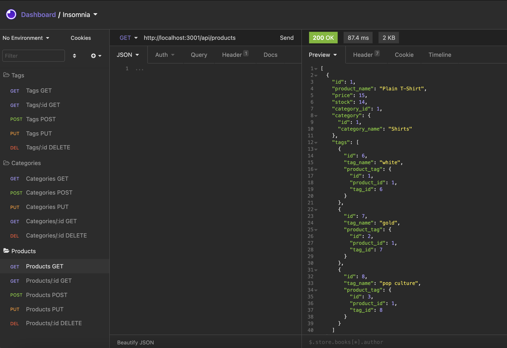
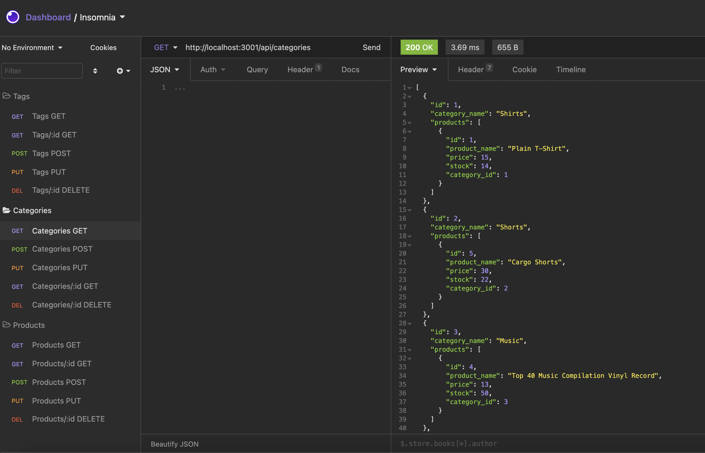
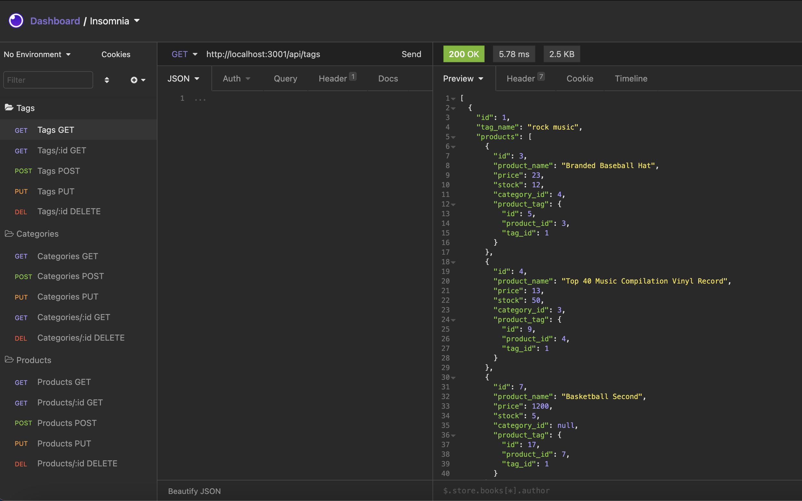

# E-Commerce Backend

## Description 
This is a simple backend application to help user manage e-commerce application. There are three tables in database: Products, Tags and Categories. User can interact with data via API calls and user is able to view, create, modify and delete data.

## Installation
MacOS users
1. Make sure you have HomeBrew installed on Mac
2. Install npm by running "brew install npm"
3. Clone or fork the repo and navigate to repo directory by using command line
4. In order to resolve dependencies run "npm i"

## Usage
Follow these steps:
1. To populate tables run command from root directory "mysql -uroot < db/schema.sql". If you have different username, change it in -uroot. And if you have password make sure to add -p in command
2. To seed database run command "node seeds/index.js"
3. To start application run "node server.js" 

## Screenshots

## Link to video

